# Introduction

This proof of concept demonstrates the transformative potential of real-time data ingestion and analysis across various industries. By leveraging Azure Cloud and Microsoft Fabric's Real-Time Intelligence offerings, businesses can address common challenges, enhance decision-making, and drive significant value. Join us on this journey to explore the future of real-time data and unlock powerful insights for your industry.

## Unlocking the Power of Real-Time Data Across Industries with Azure Cloud

In today's fast-paced world, industries are constantly seeking innovative solutions to stay ahead of the curve. The proposal with this proof of concept project is to showcase how real-time data ingestion into Azure Cloud, combined with Microsoft Fabric's Real-Time Intelligence offerings, can revolutionize various industry verticals. Let's explore how this powerful framework addresses common challenges and drives business value across different sectors.

## Logical Sequence for Business Value and Decision-Making

This sequence—**Collect, Analyze, Act**—provides a clear and logical framework for leveraging data to drive business value and support decision-making processes.

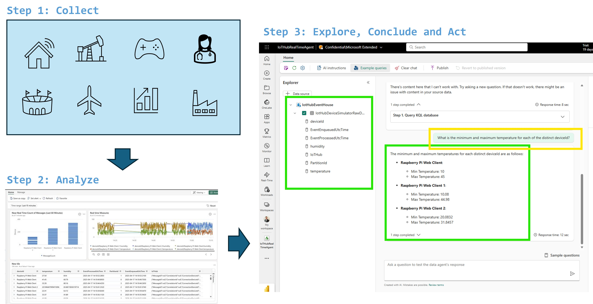

1. **Collect**
   - **Business Value**: Ensures a unified and accurate dataset for informed decision-making.
   - **Business Approach**: Establishes a strong foundation for data-driven insights.

2. **Analyze**
   - **Business Value**: Transforms raw data into meaningful information that can guide strategic decisions.
   - **Business Approach**: Utilizes advanced analytics to uncover trends, patterns, and predictions.

3. **Act**
   - **Business Value**: Drives proactive and reactive business decisions, enhancing efficiency and effectiveness.
   - **Business Approach**: Leverages real-time insights to make timely and impactful decisions.

## Proposed Framework for the POC

By leveraging these three pillars—Data Collection and Integration, Data Analysis and Visualization, and Decision Support and Automation—industries can gain valuable insights from their original data. Complementing these approaches with Real-Time Chat Agents ensures that insights are accessible, actionable, and continuously updated, driving both reactive and proactive business decisions.

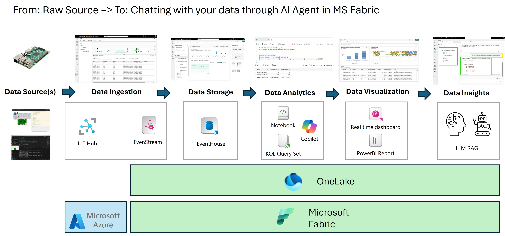

### 1. **Data Collection and Integration**

**Approach**: 
- **Data Science and Analytics**: Utilize advanced data collection methods such as IoT sensors, APIs, and data lakes to gather comprehensive datasets from various sources. Integrate these datasets to create a unified view of the industry-specific data.
- **Real-Time Chat Agent**: Deploy chat agents to interact with data sources in real-time, ensuring continuous data flow and immediate updates.

**Industry Examples**:
- **Oil & Gas**: Collect data from drilling sensors and market feeds to monitor equipment performance and price trends.
- **Healthcare**: Integrate patient records, wearable device data, and lab results for a holistic view of patient health.
- **Gaming**: Gather player interaction data and game event logs to understand player behavior and preferences.

### 2. **Data Analysis and Visualization**

**Approach**:
- **Data Science and Analytics**: Apply machine learning algorithms, predictive analytics, and visualization tools to analyze the integrated data. Generate actionable insights through dashboards and reports.
- **Real-Time Chat Agent**: Use chat agents to provide instant visualizations and summaries of the analyzed data, making insights accessible in real-time.

**Industry Examples**:
- **Manufacturing**: Analyze machinery performance data to predict maintenance needs and optimize production schedules.
- **Insurance**: Detect fraud patterns by analyzing claims data and transaction histories.
- **Internet Sales**: Visualize customer behavior trends and sales performance to tailor marketing strategies.

### 3. **Decision Support and Automation**

**Approach**:
- **Data Science and Analytics**: Develop decision support systems that leverage historical and real-time data to inform business decisions. Implement automation for routine tasks based on data-driven insights.
- **Real-Time Chat Agent**: Enable chat agents to provide real-time recommendations and automate responses to common queries, enhancing decision-making efficiency.

**Industry Examples**:
- **Healthcare**: Use predictive models to recommend treatment plans and automate patient monitoring.
- **Retail**: Automate inventory management and personalized marketing campaigns based on sales data.
- **Finance**: Provide real-time risk assessments and automate trading decisions.

## POC Value And Opportunities Across Different Industries

### Healthcare

- **Common Industry Challenge**: Patient data management and timely diagnosis.
- **Solution Proposal**: Real-time ingestion of patient data from various sources. Use LLM RAG to provide instant insights and historical analysis for better diagnosis and treatment plans.
- **Business Value**: Hospitals like Mayo Clinic use real-time data to monitor patient vitals and improve response times, enhancing patient care.

### Insurance

- **Common Industry Challenge**: Fraud detection and risk assessment.
- **Solution Proposal**: Real-time monitoring of claims and transactions. Use LLM RAG to analyze historical claims data and detect anomalies.
- **Business Value**: Companies like Allstate use real-time data to detect fraudulent claims instantly, reducing losses and improving customer trust.

### Internet Sales

- **Common Industry Challenge**: Customer behavior analysis and inventory management.
- **Solution Proposal**: Real-time tracking of customer interactions and sales data. Use LLM RAG to personalize recommendations and optimize stock levels.
- **Business Value**: Amazon leverages real-time data to provide personalized shopping experiences and manage inventory efficiently.

### Gaming

- **Common Industry Challenge**: Player engagement and real-time game balancing.
- **Solution Proposal**: Real-time ingestion and analysis of player interactions and game events. Use LLM RAG to provide dynamic content adjustments and personalized gaming experiences.
- **Business Value**: Companies like Epic Games use real-time data to monitor player behavior, adjust game difficulty, and deploy updates instantly, enhancing player satisfaction and retention.

### Oil & Gas

- **Common Industry Challenge**: Volatile oil prices and aging infrastructure.
- **Solution Proposal**: Implement real-time monitoring and visualization of equipment performance and market data. Utilize Large Language Models (LLM) with Retrieval-Augmented Generation (RAG) to analyze historical price trends and predict future fluctuations.
- **Business Value**: Companies like BP are leveraging real-time data to optimize drilling operations and reduce downtime, leading to significant cost savings and improved safety.

### Manufacturing

- **Common Industry Challenge**: Predictive maintenance and supply chain disruptions.
- **Solution Proposal**: Real-time monitoring of machinery and supply chain logistics. Use LLM RAG to predict equipment failures and optimize inventory levels.
- **Business Value**: Siemens uses real-time data to enhance predictive maintenance, reducing machine downtime and improving production efficiency.

# POC Deployment - Step by Step Method of procedure

## Requirement #1 - Create a Resource Group

1. **Go to Azure Portal**
   - Sign in to the Azure Portal.

2. **Create an Azure Resource Group**
   - Select **Resource groups** from the left-hand menu.
   - Click on **+ Create**.
   - On the **Basics** tab, select your subscription, and enter the name `iotstreamingdemo` as the resource group name.
   - Select the desired region where the resource will exist, then click **Next**.
   - 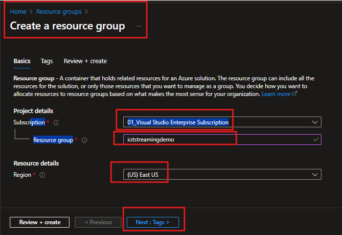

3. **Provide Tags**
   - Provide a tag name (e.g., `projectName`) and a tag value (e.g., `IoTDemo`) to help track costs related to this PoC.
   - Click **Next: Review + Create**.
   - 

4. **Create the Resource Group**
   - Click on **Create** and wait for the Resource Group to be successfully created.
   - Go to the newly created resource group.

---

## Requirement #2 - Create an Azure IoT Hub

### Task 1 - Create an Azure IoT Hub

1. **Navigate to Resource Group**
   - In the Azure Portal, go to your resource group `iotstreamingdemo`.
   - Click on **+ Create**.
   - [text](README.md) 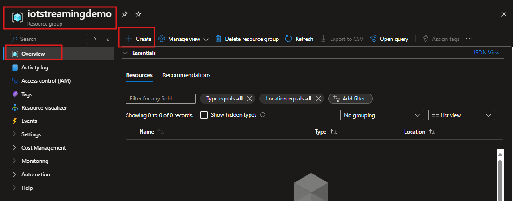

2. **Search for IoT Hub**
   - In the Marketplace screen, use the search box to search for **Azure IoT Hub**.
   - Select **Create**.
   - 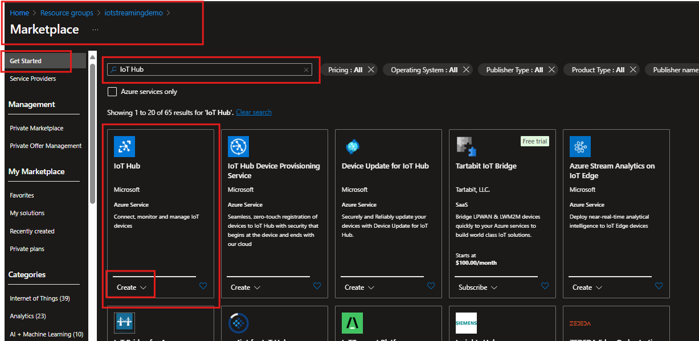

3. **Configure IoT Hub Basics**
   - On the **Basics** tab, enter the following information:
     - **Subscription**: Select your target subscription.
     - **Resource group**: `iotstreamingdemo`
     - **IoT hub name**: `iothub1free1`
     - **Region**: East US
     - **Tier**: Free
     - **Daily message limit**: 8,000
     - 
  
4. **Configure Networking**
   - On the **Networking** tab, review the default settings:
     - **Connectivity configuration**: Public access
     - **Minimum TLS Version**: 1.0
     - 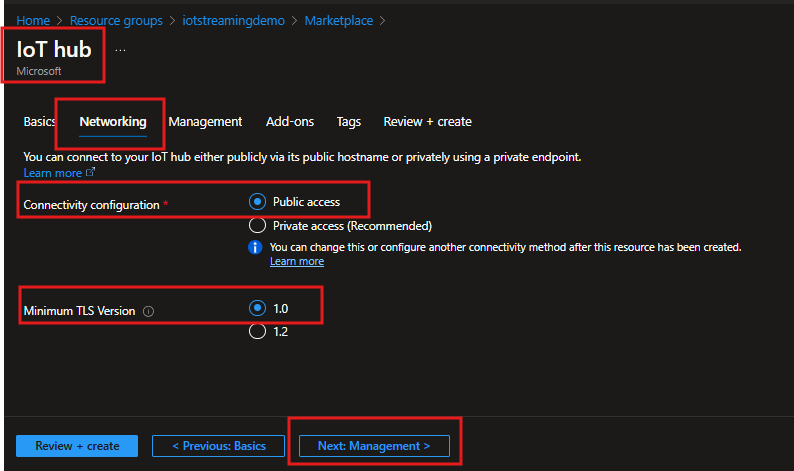

5. **Configure Management**
   - On the **Management** tab, update the settings:
     - **Permission model**: Shared access policy + RBAC
     - **Assign me**: IoT Hub Data Contributor Role
     - **Device-to-cloud partitions**: 2
     - 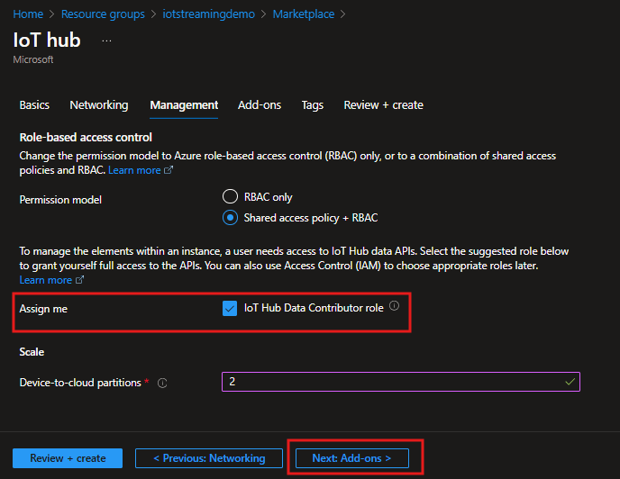

6. **Review Add-ons**
   - On the **Add-ons** tab, review the default settings.
   - Click **Next: Tags**.
   - 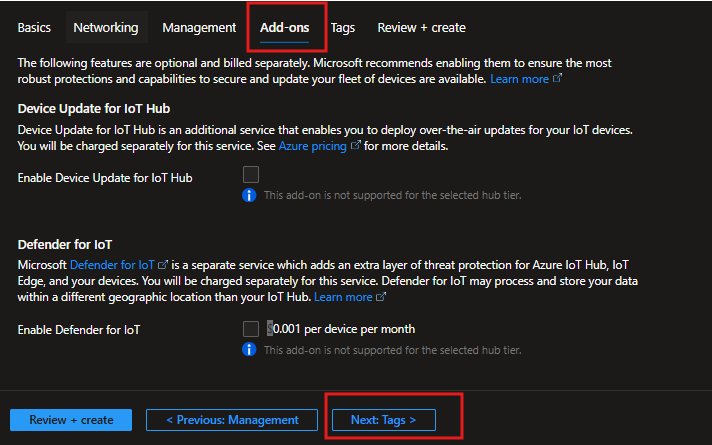

7. **Provide Tags**
   - Provide a tag name (e.g., `projectName`) and a tag value (e.g., `IoTDemo`).
   - Click **Next: Review + Create**.
   - 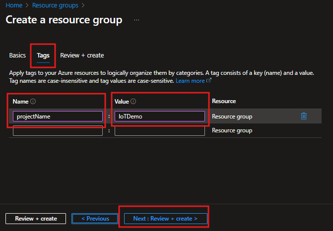

8. **Create IoT Hub**
   - Ensure the resource is successfully created in the region of your interest.
   - Go to your newly deployed IoT Hub.
   - 

## Requirement #3 - Manually Create an Azure IoT Device and Connect to Your IoT Hub

### Task 1 - Create a Device in the Azure IoT Hub
1. **Navigate to IoT Hub**
   - In the Azure Portal, navigate to your Azure IoT Hub resource `iothub1free`.

2. **Go to Device Management**
   - On the left side menu, go to the **Device Management** section and click on **Devices**.
   - 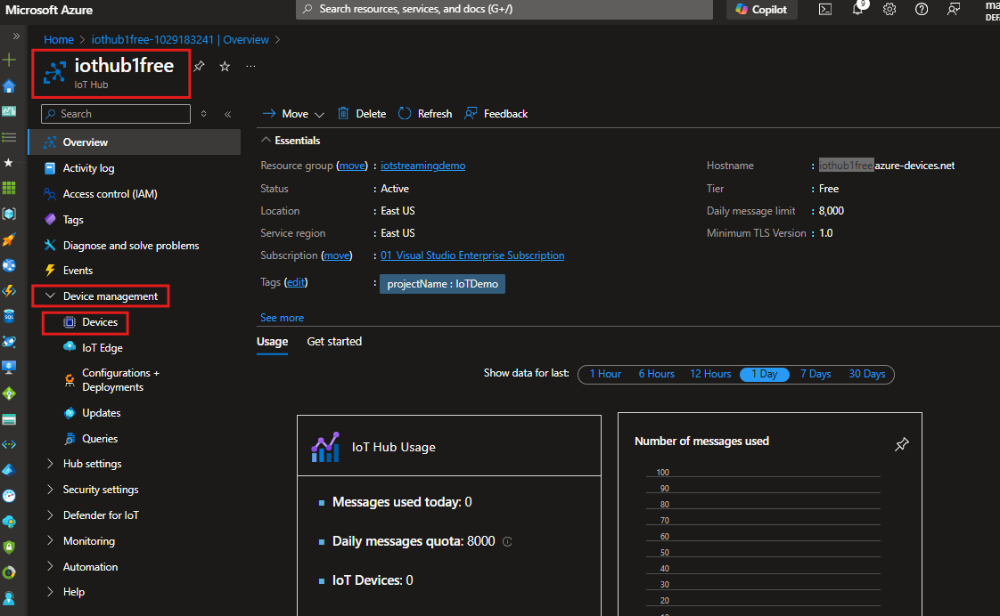

3. **Add a New Device**
   - In the main page area, click on **+ Add Device**.
   - 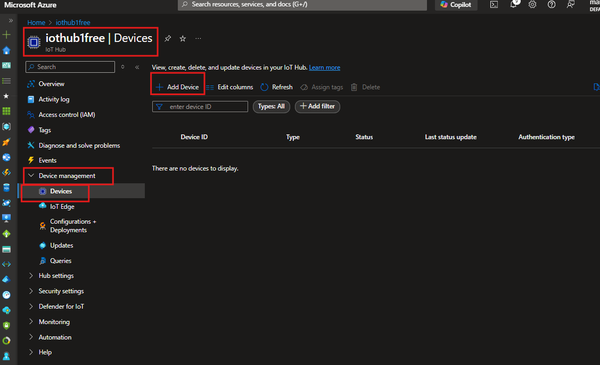

4. **Configure Device Settings**
   - In the **Create a Device** window, complete the following settings:
     - **Device ID**: `iotdevice1-iotwebsimulator`
     - **IoT Edge Device**: Leave unchecked
     - **Authentication type**: Symmetric key
     - **Auto-generate keys**: Check the box
     - **Connect this device to an IoT Hub**: Enable
     - **Parent Device**: Leave default
   - Click **Save**.
   - 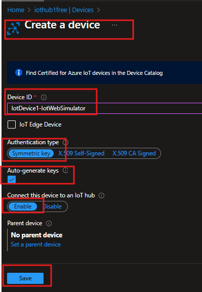

5. **Copy Connection String**
   - In the `iothub1free | Devices` page, identify your newly created device and click on it.
   - Copy the value generated for the **Primary Connection String** to a text editor on your local computer.
   - 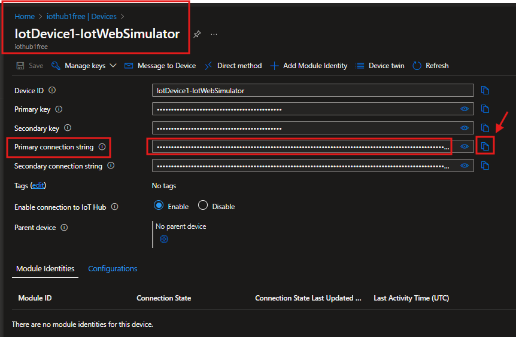

### Task 2 - Create a New Consumer Group

1. **Navigate to Built-in Endpoints**
   - In the Azure Portal, go to your IoT Hub.
   - Navigate to **Hub settings** and click on **Built-in endpoints**.

2. **Verify (And Optionally) Create Consumer Group**
   - In the main page area, click on **Consumer Groups**.
   - Think of this as a local caching where IoT Device data will resuse for up to 24 hours to prevent data loss and location for other Azure and Cloud resoruces to consume the streaming data from.
   - Optionally, You can create a new consumer group (e.g. called `iotstreaminganlyticsjobconsumergroup` ).
   - In case of changes, click **Save** to apply the changes.

### Task 3 - Ingestion of IoT Device (Simmulated) in the IoT Hub

1. **Launch IoT Simulator**
   - On a web browser, go to the [Raspberry Pi IoT Simulator](https://azure-samples.github.io/raspberry-pi-web-stor 
   - 

2. **Insert IoT Device Connection String**
   - Go to line number 15 in the code section and insert your IoT Device Primary Connection string.
   - 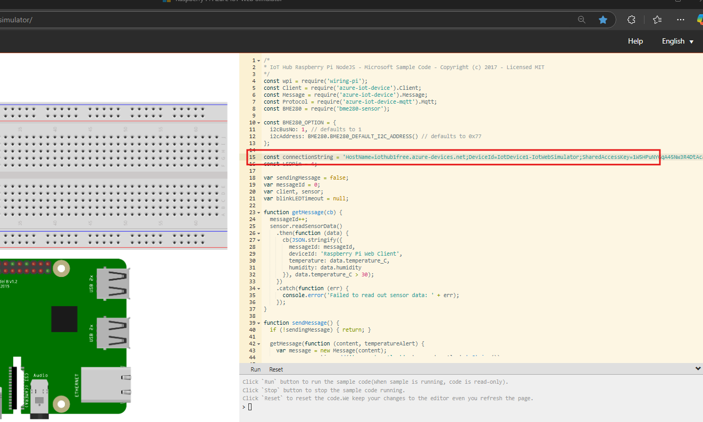

4. **Start the Device**
   - Click on the **Run** button in the simulator.
   - Ensure the red LED light starts to blink.
   - 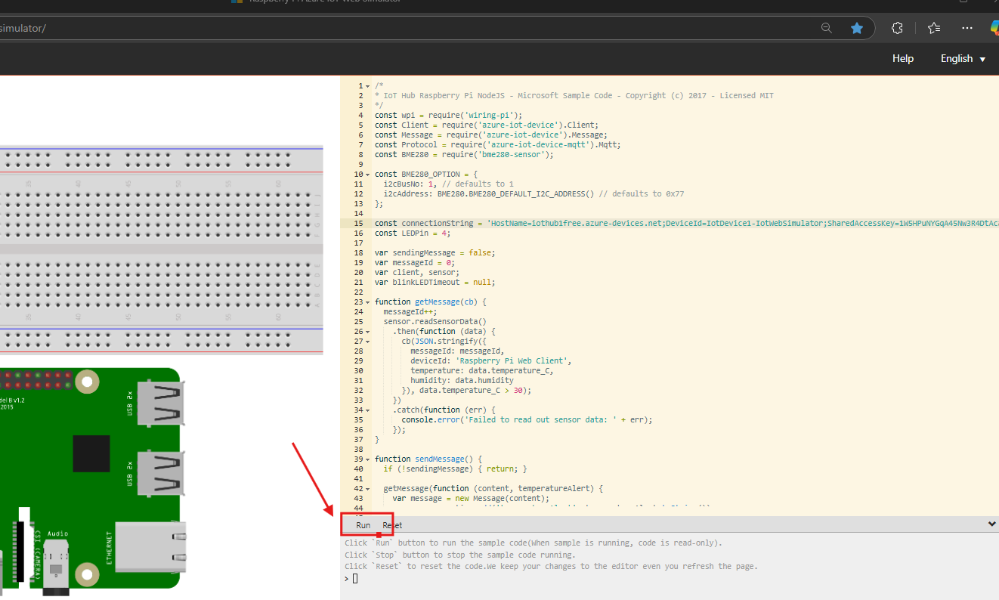

5. **Verify Data Ingestion**
   - Back in the Azure Portal, go to your IoT Hub.
   - On the **Overview** page, check the **IoT Hub Usage** tile to confirm that your device messages are being received successfully.
   - 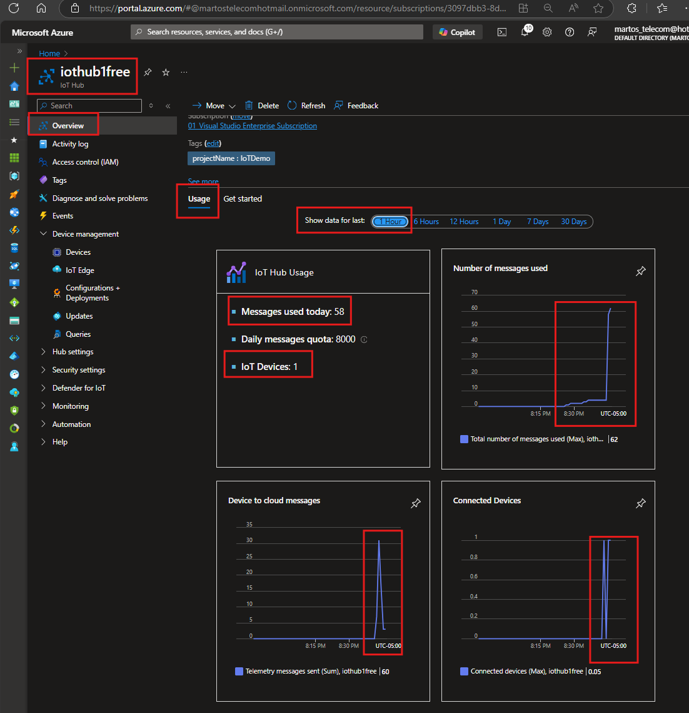

