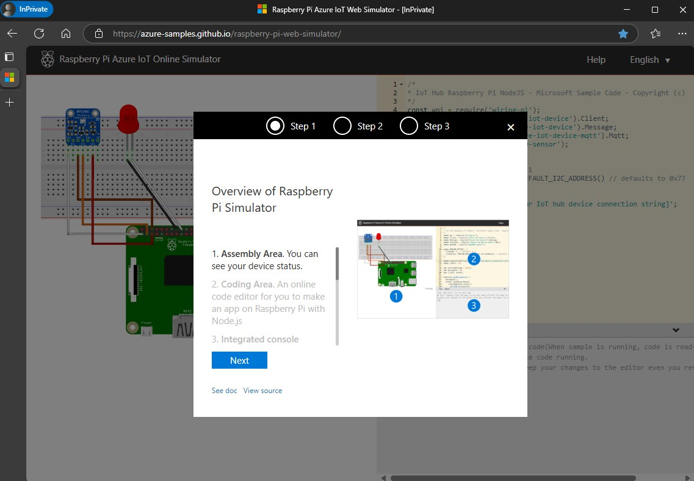
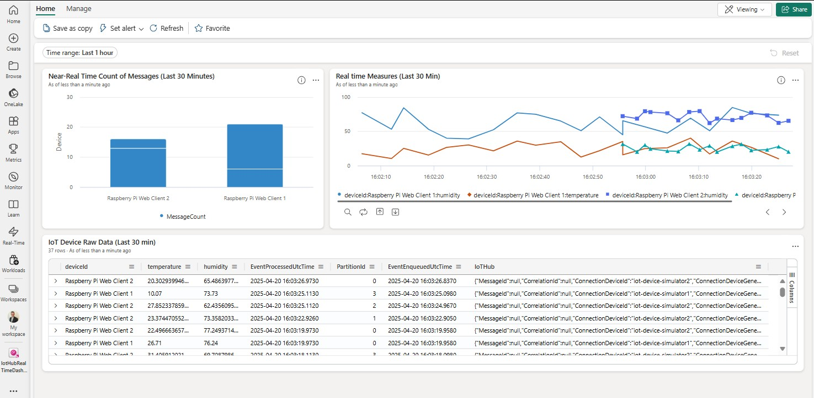
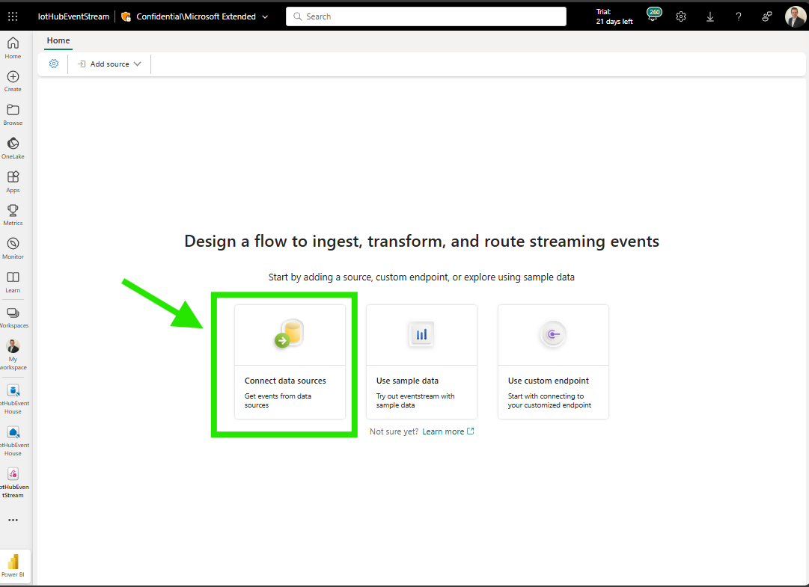
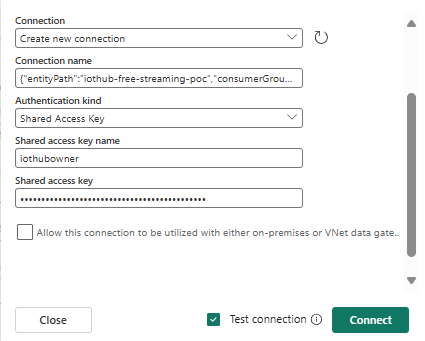

# Introduction

This proof of concept demonstrates the transformative potential of real-time data ingestion and analysis across various industries. By leveraging Azure Cloud and Microsoft Fabric's Real-Time Intelligence offerings, businesses can address common challenges, enhance decision-making, and drive significant value. Join us on this journey to explore the future of real-time data and unlock powerful insights for your industry.

## Unlocking the Power of Real-Time Data Across Industries with Azure Cloud

In today's fast-paced world, industries are constantly seeking innovative solutions to stay ahead of the curve. The proposal with this proof of concept project is to showcase how real-time data ingestion into Azure Cloud, combined with Microsoft Fabric's Real-Time Intelligence offerings, can revolutionize various industry verticals. Let's explore how this powerful framework addresses common challenges and drives business value across different sectors.


## Logical Sequence for Business Value and Decision-Making

This sequence—**Collect, Analyze, Act**—provides a clear and logical framework for leveraging data to drive business value and support decision-making processes.


1. **Collect**
   - **Business Value**: Ensures a unified and accurate dataset for informed decision-making.
   - **Business Approach**: Establishes a strong foundation for data-driven insights.

2. **Analyze**
   - **Business Value**: Transforms raw data into meaningful information that can guide strategic decisions.
   - **Business Approach**: Utilizes advanced analytics to uncover trends, patterns, and predictions.

3. **Act**
   - **Business Value**: Drives proactive and reactive business decisions, enhancing efficiency and effectiveness.
   - **Business Approach**: Leverages real-time insights to make timely and impactful decisions.

## Proposed Framework for the POC

By leveraging these three pillars—Data Collection and Integration, Data Analysis and Visualization, and Decision Support and Automation—industries can gain valuable insights from their original data. Complementing these approaches with Real-Time Chat Agents ensures that insights are accessible, actionable, and continuously updated, driving both reactive and proactive business decisions.


## POC Value And Opportunities Across Different Industries

### Healthcare

- **Common Industry Challenge**: Patient data management and timely diagnosis.
- **Solution Proposal**: Real-time ingestion of patient data from various sources. Use LLM RAG to provide instant insights and historical analysis for better diagnosis and treatment plans.
- **Business Value**: Hospitals like Mayo Clinic use real-time data to monitor patient vitals and improve response times, enhancing patient care.

### Insurance

- **Common Industry Challenge**: Fraud detection and risk assessment.
- **Solution Proposal**: Real-time monitoring of claims and transactions. Use LLM RAG to analyze historical claims data and detect anomalies.
- **Business Value**: Companies like Allstate use real-time data to detect fraudulent claims instantly, reducing losses and improving customer trust.

### Internet Sales

- **Common Industry Challenge**: Customer behavior analysis and inventory management.
- **Solution Proposal**: Real-time tracking of customer interactions and sales data. Use LLM RAG to personalize recommendations and optimize stock levels.
- **Business Value**: Amazon leverages real-time data to provide personalized shopping experiences and manage inventory efficiently.

### Gaming

- **Common Industry Challenge**: Player engagement and real-time game balancing.
- **Solution Proposal**: Real-time ingestion and analysis of player interactions and game events. Use LLM RAG to provide dynamic content adjustments and personalized gaming experiences.
- **Business Value**: Companies like Epic Games use real-time data to monitor player behavior, adjust game difficulty, and deploy updates instantly, enhancing player satisfaction and retention.

### Oil & Gas

- **Common Industry Challenge**: Volatile oil prices and aging infrastructure.
- **Solution Proposal**: Implement real-time monitoring and visualization of equipment performance and market data. Utilize Large Language Models (LLM) with Retrieval-Augmented Generation (RAG) to analyze historical price trends and predict future fluctuations.
- **Business Value**: Companies like BP are leveraging real-time data to optimize drilling operations and reduce downtime, leading to significant cost savings and improved safety.

### Manufacturing

- **Common Industry Challenge**: Predictive maintenance and supply chain disruptions.
- **Solution Proposal**: Real-time monitoring of machinery and supply chain logistics. Use LLM RAG to predict equipment failures and optimize inventory levels.
- **Business Value**: Siemens uses real-time data to enhance predictive maintenance, reducing machine downtime and improving production efficiency.

## POC Deployment

By leveraging real-time data ingestion, analysis, and visualization, this PoC demonstrates how organizations can stay ahead of the curve. Whether it's monitoring equipment performance in manufacturing, tracking patient vitals in healthcare, or analyzing customer interactions in retail, the possibilities are endless. This framework empowers businesses to make proactive and reactive decisions, ensuring they remain competitive and responsive to market demands.

### Introduction to Azure IoT Hub

Azure IoT Hub is a managed service hosted in the cloud that acts as a central message hub for communication between an IoT application and its attached devices. It enables secure and reliable bi-directional communication between millions of IoT devices and a cloud-based backend. For more detailed information, you can refer to the [Azure IoT Hub Documentation](https://learn.microsoft.com/en-us/azure/iot-hub/).

### Illustration

Think of Azure IoT Hub as a central hub in a network of spokes. Each spoke represents an IoT device, and the hub ensures that all data from these devices is collected, processed, and managed securely and reliably. This hub-and-spoke model illustrates how IoT Hub centralizes communication and data flow, making it easier to manage and scale IoT solutions.


### Security and Reliability

- **Per-Device Security Credentials**: Each device connected to IoT Hub has unique security credentials, ensuring secure communication.
- **Access Control**: IoT Hub supports role-based access control (RBAC) to manage permissions and access to data.
- **Encryption**: Data transmitted between devices and IoT Hub is encrypted to prevent interception and tampering.
- **Monitoring and Alerting**: IoT Hub provides monitoring tools to track device connections, data flow, and potential issues. Alerts can be set up to notify administrators of any anomalies.
- **High Availability**: IoT Hub is designed to be highly available, with features like cross-region redundancy and autoscaling to handle increased loads and ensure continuous operation.

For more detailed information, you can refer to the [Azure IoT Hub Documentation](https://learn.microsoft.com/en-us/azure/iot-hubFabric is an end-to-end analytics and data platform designed to handle massive streaming data with millions of messages per day. Its Real-Time Intelligence offering empowers organizations to extract insights and visualize data in motion, providing a scalable solution for event-driven scenarios, streaming data, and data logs. Real-Time Intelligence components in Fabric include Eventstreams, Eventhouses, and Real-Time Dashboards, which together enable seamless data ingestion, transformation, storage, analytics, and visualization.

#### Free Tier Capabilities and Features

- **Device-to-cloud telemetry**: Available
- **Per-device identity**: Available
- **Message routing and Event Grid integration**: Available
- **HTTP, AMQP, and MQTT protocols**: Available
- **Daily message limit**: 8,000 messages

#### Capacity and Scalability Considerations

When planning to move beyond a proof of concept (PoC) to a live deployment, consider the following aspects:

- **Message Throughput**:
  - **Basic Tier**: Up to 400,000 messages/day per unit
  - **Standard Tier**: Up to 300,000,000 messages/day per unit

- **Features**:
  - **Basic Tier**: Uni-directional communication, limited features
  - **Standard Tier**: Bi-directional communication, full feature set including device twins, cloud-to-device messaging, and IoT Edge support

- **Scalability**:
  - **Units**: Scale out by adding more units to handle increased message volume
    - **Regions**: Deploy across multiple regions for high availability and disaster recovery

For more details on choosing the right IoT Hub tier and scaling your solution, refer to the [Azure IoT Hub Scaling Guide](https://learn.microsoft.com/en-us/azure/iot-hub/iot-hub-scaling).

### Leveraging IoT Use Case for real time telemetry and Response.

Our proof of concept (PoC) for real-time data streaming using Azure IoT Hub and Microsoft Fabric is designed not just as a solution, but as a versatile framework that can be applied across various industries and segments. This framework enables businesses to gain fast insights into client behavior and operational metrics, allowing them to react promptly and effectively.


## Method of Procedure: Step 1. **Data Collection and Integration**

**Approach**: 
- **Data Science and Analytics**: Utilize advanced data collection methods such as IoT sensors, APIs, and data lakes to gather comprehensive datasets from various sources. Integrate these datasets to create a unified view of the industry-specific data.
- **Real-Time Chat Agent**: Deploy chat agents to interact with data sources in real-time, ensuring continuous data flow and immediate updates.

**Industry Examples**:
- **Oil & Gas**: Collect data from drilling sensors and market feeds to monitor equipment performance and price trends.
- **Healthcare**: Integrate patient records, wearable device data, and lab results for a holistic view of patient health.
- **Gaming**: Gather player interaction data and game event logs to understand player behavior and preferences.

### Requirement #1 - Create a Resource Group

1. **Go to Azure Portal**
   - Sign in to the Azure Portal.

2. **Create an Azure Resource Group**
   - Select **Resource groups** from the left-hand menu.
   - Click on **+ Create**.
   - On the **Basics** tab, select your subscription, and enter the name `iotstreamingdemo` as the resource group name.
   - Select the desired region where the resource will exist, then click **Next**.
   - 

3. **Provide Tags**
   - Provide a tag name (e.g., `projectName`) and a tag value (e.g., `IoTDemo`) to help track costs related to this PoC.
   - Click **Next: Review + Create**.
   - 

4. **Create the Resource Group**
   - Click on **Create** and wait for the Resource Group to be successfully created.
   - Go to the newly created resource group.

### Requirement #2 - Create an Azure IoT Hub

#### Task 1 - Create an Azure IoT Hub

Azure IoT Hub is a managed cloud service that acts as a central message hub for communication between IoT applications and their connected devices. The primary objective of IoT Hub is to enable secure and reliable bi-directional communication, allowing devices to ingest data into the cloud seamlessly.

#### Key Objectives

- **Integration of Devices**: IoT Hub facilitates the connection of millions of devices, enabling them to send telemetry data to the cloud and receive commands from the cloud. This integration is crucial for real-time monitoring and control of IoT devices.
- **Data Ingestion**: By acting as a hub, IoT Hub ensures that data from various devices is ingested into the cloud efficiently. This data can then be processed, 


1. **Navigate to Resource Group**
   - In the Azure Portal, go to your resource group `iotstreamingdemo`.
   - Click on **+ Create**.
   - [text](README.md) 

2. **Search for IoT Hub**
   - In the Marketplace screen, use the search box to search for **Azure IoT Hub**.
   - Select **Create**.
   - 

3. **Configure IoT Hub Basics**
   - On the **Basics** tab, enter the following information:
     - **Subscription**: Select your target subscription.
     - **Resource group**: `iotstreamingdemo`
     - **IoT hub name**: `iothub1free1`
     - **Region**: East US
     - **Tier**: Free
     - **Daily message limit**: 8,000
     - 
  
4. **Configure Networking**
   - On the **Networking** tab, review the default settings:
     - **Connectivity configuration**: Public access
     - **Minimum TLS Version**: 1.0
     - 

5. **Configure Management**
   - On the **Management** tab, update the settings:
     - **Permission model**: Shared access policy + RBAC
     - **Assign me**: IoT Hub Data Contributor Role
     - **Device-to-cloud partitions**: 2
     - 

6. **Review Add-ons**
   - On the **Add-ons** tab, review the default settings.
   - Click **Next: Tags**.
   - 

7. **Provide Tags**
   - Provide a tag name (e.g., `projectName`) and a tag value (e.g., `IoTDemo`).
   - Click **Next: Review + Create**.
   - 

8. **Create IoT Hub**
   - Ensure the resource is successfully created in the region of your interest.
   - Go to your newly deployed IoT Hub.
   - 

## Requirement #3 - Manually Create an Azure IoT Device and Connect to Your IoT Hub

### Task 1 - Create a Device in the Azure IoT Hub
1. **Navigate to IoT Hub**
   - In the Azure Portal, navigate to your Azure IoT Hub resource `iothub1free`.

2. **Go to Device Management**
   - On the left side menu, go to the **Device Management** section and click on **Devices**.
   - 

3. **Add a New Device**
   - In the main page area, click on **+ Add Device**.
   - 

4. **Configure Device Settings**
   - In the **Create a Device** window, complete the following settings:
     - **Device ID**: `iotdevice1-iotwebsimulator`
     - **IoT Edge Device**: Leave unchecked
     - **Authentication type**: Symmetric key
     - **Auto-generate keys**: Check the box
     - **Connect this device to an IoT Hub**: Enable
     - **Parent Device**: Leave default
   - Click **Save**.
   - 

5. **Copy Connection String**
   - In the `iothub1free | Devices` page, identify your newly created device and click on it.
   - Copy the value generated for the **Primary Connection String** to a text editor on your local computer.
   - 

### Task 2 - Create a New Consumer Group

1. **Navigate to Built-in Endpoints**
   - In the Azure Portal, go to your IoT Hub.
   - Navigate to **Hub settings** and click on **Built-in endpoints**.

2. **Verify (And Optionally) Create Consumer Group**
   - In the main page area, click on **Consumer Groups**.
   - Think of this as a local caching where IoT Device data will resuse for up to 24 hours to prevent data loss and location for other Azure and Cloud resoruces to consume the streaming data from.
   - Optionally, You can create a new consumer group (e.g. called `iotstreaminganlyticsjobconsumergroup` ).
   - In case of changes, click **Save** to apply the changes.

### Task 3 - Ingestion of IoT Device (Simmulated) in the IoT Hub

1. **Launch IoT Simulator**
   - On a web browser, go to the [Raspberry Pi IoT Simulator](https://azure-samples.github.io/raspberry-pi-web-stor 
   - 

2. **Insert IoT Device Connection String**
   - Go to line number 15 in the code section and insert your IoT Device Primary Connection string.
   - 

4. **Start the Device**
   - Click on the **Run** button in the simulator.
   - Ensure the red LED light starts to blink.
   - 

5. **Verify Data Ingestion**
   - Back in the Azure Portal, go to your IoT Hub.
   - On the **Overview** page, check the **IoT Hub Usage** tile to confirm that your device messages are being received successfully.
   - 

## Method of Procedure: Step 2. **Data Analysis and Visualization**

The objective of this section is to be able to visualize the IoT Device data in Near-Real-Time and achieve a similar real time dashboard as illustrted below:



**Approach**:
- **Data Science and Analytics**: Apply machine learning algorithms, predictive analytics, and visualization tools to analyze the integrated data. Generate actionable insights through dashboards and reports.
- **Real-Time Chat Agent**: Use chat agents to provide instant visualizations and summaries of the analyzed data, making insights accessible in real-time.

**Industry Examples**:
- **Manufacturing**: Analyze machinery performance data to predict maintenance needs and optimize production schedules.
- **Insurance**: Detect fraud patterns by analyzing claims data and transaction histories.
- **Internet Sales**: Visualize customer behavior trends and sales performance to tailor marketing strategies.

### Integration of IoT Hub and Microsoft Fabric for Real-Time Data Streaming

In Microsoft Fabric, the first two resources to be created for real-time data streaming are the Eventstream and Eventhouse. The Eventhouse serves as the storage layer, hosting and storing logs and data ingested from various sources. 


It is essential to create the Eventhouse first, as the Eventstream depends on it to store and manage the incoming data. Once the Eventhouse is set up, the Eventstream can be configured to connect to it, ensuring a seamless flow of data from IoT Hub to the storage layer, enabling efficient data processing and visualization.

#### Requirement #4 - Create a New Event Stream Solution in Microsoft Fabric


**Task #1 - Create an Event House in Fabric**

1. **Create an Event House**
   - Navigate to **My workspace**.
   - Select **+ New item** and choose **Eventhouse**.
   - Enter a name for the eventhouse and select **Create**.

**Task #2 - Create an Event Stream in Fabric**

1. **Open Event Stream**
   - Navigate to the Fabric portal.
   - Select **My workspace** on the left navigation bar.
   - On the **My workspace** page, select **+ New item** on the command bar.
   - Search for **Eventstream** and select **Eventstream**.
   - Enter a name for the eventstream and select **Create**.

2. **Connect Data Sources**
   - In the Eventstream editor, click on **Connect data sources**.
    

3. **Choose IoT Hub**
   - Select **Azure IoT Hub** from the list of data sources.
   - Select **New connection**.
    

4. **Enter Properties from IoT Hub into Fabric Connection**
   - **From IoT Hub**:
     - Name of your Azure IoT Hub
     - Shared Access Key Name
     - Shared Access Key
    

   - **To Fabric**:
     - Connection name
     - Authentication method: Shared Access Key
    

5. **Click Next**
   - Proceed to the next step.
    

6. **Preview Data in Event Stream**
   - Ensure a good flow of data from IoT Hub to Fabric.
    

**Task #3 - Setup the Event Stream to Connect IoT Hub to Your Event House**

1. **Connect Event Stream to Event House**
   - In the Eventstream editor, connect the eventstream to the eventhouse.
    

2. **Provide Eventhouse Database**
   - Create a new table called `IotHubDeviceSimulatorRaw`.
    

3. **Publish the Event Stream**
   - Publish the eventstream.
    

4. **Verify Data in Event House**
   - After a short period (from seconds up to a minute) you should have enough data on the new table.
   - Go to your eventhouse and check that:
     - The table has been created with a matching schema.
     - Data availability in the table (again, it may take just a few seconds typically to be able to interact, as this is a new resource).
    

### Requirement #5 - Create a Power BI Dashboard to Visualize the Data

1. **Create a Real-Time Dashboard**
   - From the workspace, create a real-time dashboard.
    

2. **Connect to Eventhouse**
   - From the real-time dashboard, create a connection to your eventhouse.
    

3. **Accept Defaults and Proceed**
   - Accept the default settings and proceed.
    

4. **Add a Tile with a Table**
   - Ensure the dashboard can access the eventhouse.

5. **Create Kusto Query Language (KQL) Queries**

   - Create a Kusto query language of your choice to show some aggregation, following the json file format. Here is an example for ilustration:

```text
(Prompt Example)
You are a Kusto Query Language expert assisting with Microsoft Fabric to create a real time dashboard.
Your task is to analyze the sample of an IoT Data, and assist with creating an two plots for visualization.
First KQL will aggregate every minute how many messages were transmitted.
Second KQL will aggragate each of the telemetry as average for that minute.
---
"deviceId": Raspberry Pi Web Client, "temperature": 25, "humidity": 50, "EventProcessedUtcTime": 2025-04-16T14:49:18.9987857Z, "PartitionId": 0, "EventEnqueuedUtcTime": 2025-04-16T14:49:18.876Z, "IoTHub": { "MessageId": null, "CorrelationId": null, "ConnectionDeviceId": "iot-device-simulator1", "ConnectionDeviceGenerationId": "638804068999018576", "EnqueuedTime": "2025-04-16T14:49:13.5290000Z" }, "IngestionTime": 2025-04-16T14:49:19.3366325Z, "__timeColumn": 2025-04-16T14:49:19.3366325Z 
```

   - **Aggregating the Number of Messages Transmitted Every Minute**:

```kql
     IoTData
     | summarize MessageCount = count() by bin(EventProcessedUtcTime, 1m)
```

   - **Aggregating the Average Telemetry Data Every Minute**:

```kql
     IoTData
     | summarize AvgTemperature = avg(temperature), AvgHumidity = avg(humidity) by bin(EventProcessedUtcTime, 1m)
```

6. **Test KQL Queries and Create Visual Dashboard**
   - Test each KQL query 
    

   - And create visualizations on the dashboard.
    

### 3. **Decision Support and Automation**

#### Enhancing Real-Time Visualization

By integrating a Fabric data agent, you enhance the real-time visualization capabilities achieved with IoT Hub and Microsoft Fabric. The data agent allows users to:

- **Interact with Data**: Users can ask questions in plain language and receive data-driven answers, making it easier to explore and understand real-time data.
- **Access Insights**: The data agent processes queries and provides insights based on the most relevant data sources, ensuring accurate and timely information.
- **Improve Decision-Making**: With real-time access to data insights, users can make informed decisions quickly, enhancing the overall responsiveness and agility of the organization.

#### Introduction to Microsoft Fabric Data Agent

Microsoft Fabric Data Agent is a powerful feature currently in preview that allows you to create conversational AI experiences. These agents can answer questions about data stored in lakehouses, warehouses, Power BI semantic models, and KQL databases within Fabric. By integrating a data agent, you can enhance real-time visualization by enabling users to interact with their data through natural language queries, making insights more accessible and actionable 

[1 - How to Create and Agent](https://learn.microsoft.com/en-us/fabric/data-science/how-to-create-data-agent) 

[2 - Concept of Fabric Data Agent](https://learn.microsoft.com/en-us/fabric/data-science/concept-data-agent).


**Approach**:
- **Data Science and Analytics**: Develop decision support systems that leverage historical and real-time data to inform business decisions. Implement automation for routine tasks based on data-driven insights.
- **Real-Time Chat Agent**: Enable chat agents to provide real-time recommendations and automate responses to common queries, enhancing decision-making efficiency.

**Industry Examples**:
- **Healthcare**: Use predictive models to recommend treatment plans and automate patient monitoring.
- **Retail**: Automate inventory management and personalized marketing campaigns based on sales data.
- **Finance**: Provide real-time risk assessments and automate trading decisions.


### Step-by-Step Procedure to Create a Data Agent

#### Prerequisites

- A paid F64 or higher Fabric capacity resource (ALternatively, you can use a Trial License for 60 days)
- Fabric data agent tenant settings enabled
- Copilot tenant switch enabled
- Cross-geo processing for AI enabled
- Cross-geo storing for AI enabled
- At least one of the following: 
  - a warehouse, a lakehouse, one or more Power BI semantic models, or a KQL database with data

#### Task 1: Create a Fabric Data Agent

1. **Navigate to Your Workspace**
   - Open the Fabric portal and go to your workspace.
   - Select **+ New Item**.
    

2. **Search for Fabric Data Agent**
   - In the **All items** tab, search for **Fabric data agent**.
   - Select the **Fabric data agent** option.
    

3. **Provide a Name**
   - Enter a name for your Fabric data agent.
   - Click **Create**.

4. **Select Your Data Sources**
   - After creating the data agent, you can add up to five data sources, including lakehouses, warehouses, Power BI semantic models, and KQL databases.
   - Select the data sources from the OneLake catalog and click **Add**.

5. **Configure Data Source Access**
   - Use the checkboxes to make tables available or unavailable to the AI.
   - Ensure that the data sources are correctly configured to allow the data agent to access the necessary data.

6. **Create some KQL Examples to reinforce the Agent Skills**
   - Create and test some KQL examples to set a ground for your Data Agent for your use case.
    

7. **Save and Publish**
   - Save your configuration and publish the data agent.

8. **Time to experiment with your agent**
   - Ask some questions about most recent data sent to your agent


For more detailed information, you can refer to the [Microsoft Fabric Data Agent Documentation](https://learn.microsoft.com/en-us/fabric/data-science/how-to-create-data-agent).
